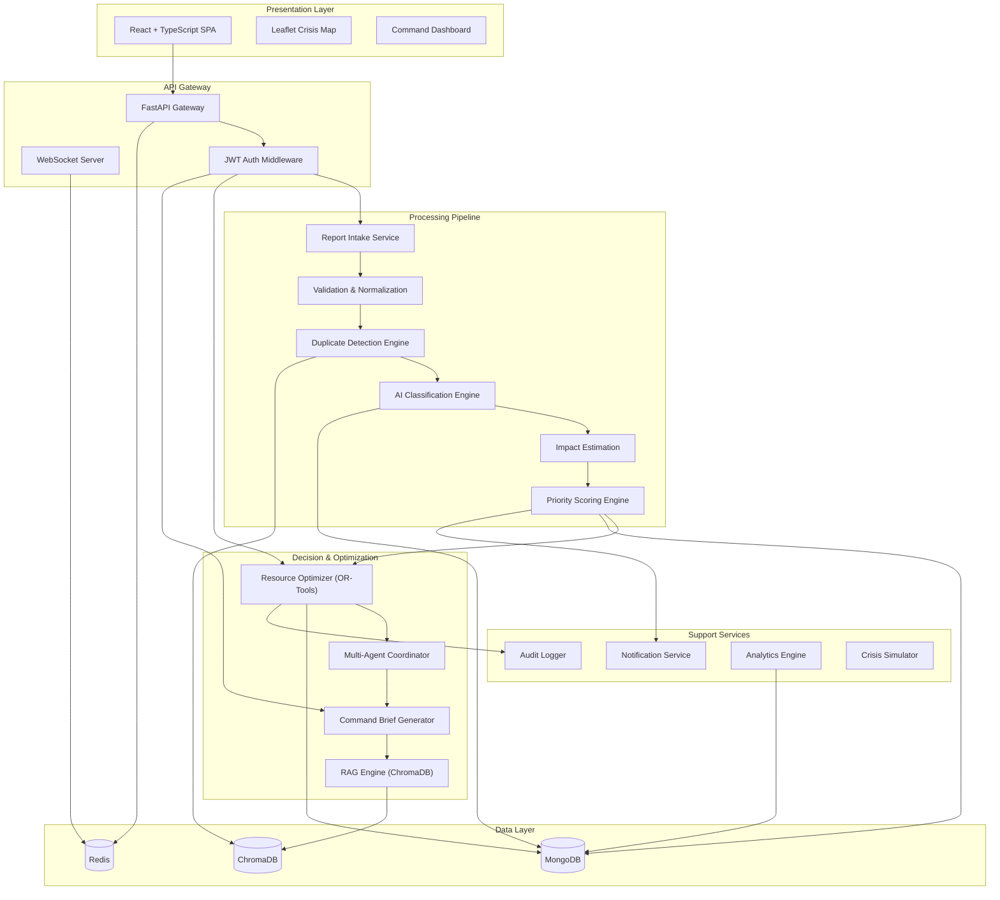

# ResQNet AI — Architecture & Implementation Plan

## 1. Problem Context

Emergency responders fail not from lack of data, but from **information overload**: scattered sources, duplicates, no prioritization, and no resource optimization. ResQNet AI transforms fragmented emergency reports into **actionable intelligence** by answering: *"Given everything happening right now, what should responders do first?"*

---

## 2. High-Level Architecture



---

## 3. Key Technical Decisions

### 3.1 Why FastAPI (not Django/Flask)?
- **Async-native**: WebSocket support, concurrent AI calls to Gemini API
- **Pydantic integration**: Type-safe request/response validation at every boundary
- **OpenAPI auto-docs**: Self-documenting APIs critical for multi-team hackathon
- **Performance**: ASGI server handles high-throughput report ingestion

### 3.2 Why MongoDB (not PostgreSQL)?
- **Schema flexibility**: Emergency reports vary wildly in structure (citizen text vs. hospital API vs. IoT sensor data)
- **Geospatial indexing**: Native `2dsphere` indexes for proximity queries on incident/resource locations
- **Document model**: Incidents with nested AI analyses, resource assignments, and audit trails fit naturally
- **Aggregation pipeline**: Complex analytics (heatmaps, trends) without ORM overhead

### 3.3 Why Redis?
- **WebSocket pub/sub**: Real-time incident updates fan out to all connected dashboards
- **Session/cache**: JWT token blacklist, rate limiting, hot resource inventory cache
- **Task queue**: Lightweight background job dispatch for AI processing pipeline

### 3.4 Why ChromaDB?
- **Duplicate detection**: Semantic similarity search on report embeddings
- **RAG retrieval**: Disaster SOPs, emergency protocols, historical incident patterns
- **Lightweight**: No infrastructure overhead vs. Pinecone/Weaviate

### 3.5 Why Google OR-Tools (not heuristic allocation)?
- **Mathematical optimality**: Constraint programming ensures provably good resource assignments
- **Multi-objective**: Balance lives saved vs. travel time vs. resource waste simultaneously
- **Scalable**: Handles 100s of incidents × 100s of resources in milliseconds
- **Explainable**: Constraint model produces auditable assignment rationale

### 3.6 Frontend Architecture
- **React + TypeScript**: Type safety, component reusability, ecosystem maturity
- **Tailwind CSS + Shadcn UI**: Rapid, consistent UI with accessible components
- **Leaflet.js**: Open-source mapping (no API key dependency unlike Google Maps)
- **React Query**: Server state management with automatic caching/revalidation
- **Framer Motion**: Smooth animations for alerts, transitions, dashboard elements

### 3.7 Multi-Agent AI Architecture
Instead of a monolithic AI pipeline, we use **specialized agents** that can be independently tested, tuned, and replaced:

| Agent | Responsibility | Model/Tool |
|-------|---------------|------------|
| **Incident Analyst** | Classify type, extract severity, urgency, affected count | Gemini API |
| **Duplicate Detector** | Semantic + spatiotemporal deduplication | Sentence Transformers + ChromaDB |
| **Impact Estimator** | Estimate resource demands per incident | Gemini API + historical patterns |
| **Resource Allocator** | Optimal assignment under constraints | OR-Tools CP-SAT solver |
| **Medical Coordinator** | Hospital load balancing, triage recommendations | Gemini API + hospital data |
| **Command Briefer** | Generate human-readable operational summaries | Gemini API + RAG |

---

## 4. Database Schemas

### 4.1 MongoDB Collections

#### `users`
```json
{
  "_id": "ObjectId",
  "email": "string (unique, indexed)",
  "password_hash": "string",
  "full_name": "string",
  "role": "enum: citizen | volunteer | hospital | shelter_manager | field_officer | coordinator | gov_admin | super_admin",
  "phone": "string",
  "organization": "string | null",
  "assigned_region": "GeoJSON Polygon | null",
  "is_active": "boolean",
  "permissions": ["string"],
  "created_at": "datetime",
  "updated_at": "datetime",
  "last_login": "datetime | null"
}
```

#### `incidents`
```json
{
  "_id": "ObjectId",
  "incident_id": "string (RESQ-YYYYMMDD-XXXX, unique, indexed)",
  "status": "enum: new | processing | verified | assigned | in_progress | resolved | closed | duplicate",
  "source": {
    "type": "enum: citizen | field_officer | hospital | shelter | ngo | iot_sensor | api | csv_import",
    "reporter_id": "ObjectId | null (ref: users)",
    "reporter_name": "string | null",
    "reporter_contact": "string | null",
    "submission_channel": "enum: web | mobile | api | sms | whatsapp"
  },
  "raw_report": {
    "text": "string",
    "images": ["string (S3/local URLs)"],
    "audio_transcript": "string | null",
    "metadata": "object (any source-specific fields)"
  },
  "location": {
    "type": "Point",
    "coordinates": ["longitude", "latitude"],
    "address": "string | null",
    "landmark": "string | null",
    "region": "string | null",
    "accuracy_meters": "number | null"
  },
  "ai_analysis": {
    "incident_type": "enum: flood | earthquake | wildfire | medical | infrastructure | shelter_overload | power_outage | evacuation | chemical | collapse | other",
    "severity": "enum: low | moderate | high | critical | catastrophic",
    "urgency": "enum: low | medium | high | immediate",
    "people_affected": "number",
    "vulnerable_populations": {
      "children": "number",
      "elderly": "number",
      "disabled": "number",
      "pregnant": "number",
      "chronic_illness": "number"
    },
    "resource_requirements": [
      {
        "resource_type": "string",
        "quantity": "number",
        "urgency": "enum: low | medium | high | immediate"
      }
    ],
    "confidence_score": "number (0.0–1.0)",
    "reasoning": "string",
    "processed_at": "datetime"
  },
  "impact_estimate": {
    "medical_demand": "number",
    "shelter_demand": "number",
    "food_water_demand": "number",
    "rescue_demand": "number",
    "infrastructure_damage_score": "number (0–10)",
    "estimated_duration_hours": "number",
    "economic_impact_estimate": "number | null"
  },
  "priority": {
    "score": "number (0–100)",
    "rank": "number (position among active incidents)",
    "factors": {
      "severity_score": "number",
      "urgency_score": "number",
      "people_affected_score": "number",
      "vulnerability_score": "number",
      "resource_scarcity_score": "number",
      "accessibility_score": "number",
      "shelter_load_score": "number",
      "hospital_load_score": "number"
    },
    "explanation": "string",
    "calculated_at": "datetime"
  },
  "duplicate_group_id": "string | null (links duplicate reports)",
  "assigned_resources": [
    {
      "resource_id": "ObjectId (ref: resources)",
      "assigned_at": "datetime",
      "eta_minutes": "number",
      "status": "enum: dispatched | en_route | on_scene | returning"
    }
  ],
  "response_plan": {
    "recommended_actions": ["string"],
    "resource_assignments": ["object"],
    "expected_impact": "string",
    "alternatives": ["string"],
    "explanation": "string",
    "generated_at": "datetime"
  },
  "timeline": [
    {
      "event": "string",
      "timestamp": "datetime",
      "actor": "string",
      "details": "string | null"
    }
  ],
  "created_at": "datetime",
  "updated_at": "datetime"
}
```
**Indexes**: `location` (2dsphere), `status`, `priority.score` (descending), `incident_id` (unique), `duplicate_group_id`, `created_at`, compound `{status, priority.score}`

#### `resources`
```json
{
  "_id": "ObjectId",
  "resource_id": "string (RES-TYPE-XXXX, unique)",
  "type": "enum: ambulance | rescue_boat | medical_team | volunteer_team | food_supply | water_supply | medical_kit | shelter | generator | police_unit | fire_unit | helicopter | drone",
  "name": "string",
  "status": "enum: available | assigned | in_transit | on_scene | maintenance | offline",
  "location": {
    "type": "Point",
    "coordinates": ["longitude", "latitude"],
    "last_updated": "datetime"
  },
  "capacity": {
    "total": "number",
    "current_load": "number",
    "unit": "string (people | kg | liters | units)"
  },
  "capabilities": ["string"],
  "assigned_incident_id": "ObjectId | null (ref: incidents)",
  "base_location": {
    "type": "Point",
    "coordinates": ["longitude", "latitude"]
  },
  "organization": "string",
  "contact": "string | null",
  "deployment_history": [
    {
      "incident_id": "ObjectId",
      "deployed_at": "datetime",
      "returned_at": "datetime | null",
      "outcome": "string | null"
    }
  ],
  "created_at": "datetime",
  "updated_at": "datetime"
}
```
**Indexes**: `location` (2dsphere), `type`, `status`, compound `{type, status}`

#### `shelters`
```json
{
  "_id": "ObjectId",
  "shelter_id": "string",
  "name": "string",
  "location": { "type": "Point", "coordinates": [] },
  "address": "string",
  "total_capacity": "number",
  "current_occupancy": "number",
  "occupancy_percentage": "number",
  "status": "enum: open | full | closed | evacuating",
  "facilities": ["medical", "food", "water", "power", "sanitation"],
  "contact_person": "string",
  "contact_phone": "string",
  "manager_id": "ObjectId | null (ref: users)",
  "supplies": {
    "food_days_remaining": "number",
    "water_days_remaining": "number",
    "medical_kits": "number",
    "blankets": "number"
  },
  "updated_at": "datetime"
}
```

#### `hospitals`
```json
{
  "_id": "ObjectId",
  "hospital_id": "string",
  "name": "string",
  "location": { "type": "Point", "coordinates": [] },
  "total_beds": "number",
  "available_beds": "number",
  "icu_beds_total": "number",
  "icu_beds_available": "number",
  "er_capacity": "number",
  "er_current_load": "number",
  "specialties": ["string"],
  "blood_bank_status": "object",
  "ambulances_available": "number",
  "status": "enum: operational | limited | overwhelmed | evacuating | offline",
  "contact": "string",
  "updated_at": "datetime"
}
```

#### `audit_logs`
```json
{
  "_id": "ObjectId",
  "action": "string",
  "entity_type": "enum: incident | resource | shelter | hospital | user | system",
  "entity_id": "string",
  "actor_id": "ObjectId | null",
  "actor_role": "string",
  "details": "object",
  "ai_decision": {
    "model": "string",
    "input_summary": "string",
    "output_summary": "string",
    "confidence": "number",
    "reasoning": "string"
  },
  "timestamp": "datetime"
}
```

#### `command_briefs`
```json
{
  "_id": "ObjectId",
  "brief_id": "string",
  "generated_by": "ObjectId (ref: users) | system",
  "time_range": { "from": "datetime", "to": "datetime" },
  "situation_overview": "string (markdown)",
  "priority_incidents": ["ObjectId"],
  "recommended_actions": ["object"],
  "resource_deployment": "object",
  "risks": ["string"],
  "next_steps": ["string"],
  "raw_markdown": "string",
  "pdf_url": "string | null",
  "created_at": "datetime"
}
```

### 4.2 Redis Keys

| Key Pattern | Purpose | TTL |
|-------------|---------|-----|
| `session:{user_id}` | Active session data | 24h |
| `token_blacklist:{jti}` | Revoked JWT tokens | Token expiry |
| `resource_cache:{type}` | Hot resource inventory | 30s |
| `incident_feed` | Redis Stream for live updates | — |
| `ws:channel:{region}` | Pub/sub for regional updates | — |
| `rate_limit:{ip}` | API rate limiting | 1min |
| `priority_queue` | Sorted set of incident priorities | — |

### 4.3 ChromaDB Collections

| Collection | Purpose | Embedding Model |
|------------|---------|-----------------|
| `report_embeddings` | Duplicate detection via semantic similarity | `all-MiniLM-L6-v2` |
| `disaster_sops` | RAG retrieval of emergency protocols | `all-MiniLM-L6-v2` |
| `historical_incidents` | Pattern matching with past events | `all-MiniLM-L6-v2` |

---

## 5. API Design

### 5.1 Authentication

| Method | Endpoint | Description | Auth |
|--------|----------|-------------|------|
| POST | `/api/v1/auth/register` | Register new user | Public |
| POST | `/api/v1/auth/login` | Login, returns JWT pair | Public |
| POST | `/api/v1/auth/refresh` | Refresh access token | Refresh token |
| POST | `/api/v1/auth/logout` | Blacklist current token | Bearer |
| GET | `/api/v1/auth/me` | Get current user profile | Bearer |

### 5.2 Incidents

| Method | Endpoint | Description | Auth |
|--------|----------|-------------|------|
| POST | `/api/v1/incidents` | Submit new incident report | Citizen+ |
| GET | `/api/v1/incidents` | List incidents (filterable, paginated) | Field Officer+ |
| GET | `/api/v1/incidents/{id}` | Get incident details | Field Officer+ |
| PATCH | `/api/v1/incidents/{id}` | Update incident status/details | Coordinator+ |
| POST | `/api/v1/incidents/{id}/reprocess` | Re-run AI analysis | Coordinator+ |
| GET | `/api/v1/incidents/priority-queue` | Get priority-ranked incident list | Coordinator+ |
| POST | `/api/v1/incidents/bulk-import` | CSV/JSON bulk import | Coordinator+ |
| GET | `/api/v1/incidents/{id}/timeline` | Get incident event timeline | Field Officer+ |
| POST | `/api/v1/incidents/{id}/merge` | Merge duplicate incidents | Coordinator+ |

### 5.3 Resources

| Method | Endpoint | Description | Auth |
|--------|----------|-------------|------|
| GET | `/api/v1/resources` | List resources (filterable) | Field Officer+ |
| POST | `/api/v1/resources` | Register new resource | Coordinator+ |
| PATCH | `/api/v1/resources/{id}` | Update resource status/location | Field Officer+ |
| POST | `/api/v1/resources/optimize` | Run optimization for incident(s) | Coordinator+ |
| GET | `/api/v1/resources/summary` | Resource inventory summary | Field Officer+ |

### 5.4 Shelters & Hospitals

| Method | Endpoint | Description | Auth |
|--------|----------|-------------|------|
| GET | `/api/v1/shelters` | List shelters | Field Officer+ |
| PATCH | `/api/v1/shelters/{id}` | Update shelter status | Shelter Manager+ |
| GET | `/api/v1/hospitals` | List hospitals | Field Officer+ |
| PATCH | `/api/v1/hospitals/{id}` | Update hospital status | Hospital+ |

### 5.5 AI & Decision Support

| Method | Endpoint | Description | Auth |
|--------|----------|-------------|------|
| POST | `/api/v1/ai/analyze` | Analyze a single report (debug) | Coordinator+ |
| POST | `/api/v1/ai/command-brief` | Generate command briefing | Coordinator+ |
| GET | `/api/v1/ai/command-briefs` | List past briefs | Coordinator+ |
| GET | `/api/v1/ai/command-briefs/{id}` | Get brief detail + PDF | Coordinator+ |
| POST | `/api/v1/ai/response-plan/{incident_id}` | Generate response plan | Coordinator+ |

### 5.6 Analytics

| Method | Endpoint | Description | Auth |
|--------|----------|-------------|------|
| GET | `/api/v1/analytics/overview` | Dashboard summary stats | Coordinator+ |
| GET | `/api/v1/analytics/incidents/trends` | Incident trend data | Coordinator+ |
| GET | `/api/v1/analytics/resources/utilization` | Resource usage analytics | Coordinator+ |
| GET | `/api/v1/analytics/response-times` | Response time analytics | Coordinator+ |
| GET | `/api/v1/analytics/heatmap` | Incident heatmap data | Coordinator+ |

### 5.7 WebSocket

| Channel | Description |
|---------|-------------|
| `ws://host/ws/incidents` | Real-time incident updates |
| `ws://host/ws/resources` | Resource status changes |
| `ws://host/ws/alerts` | Critical alert broadcast |
| `ws://host/ws/dashboard` | Dashboard metric updates |

### 5.8 Simulation

| Method | Endpoint | Description | Auth |
|--------|----------|-------------|------|
| POST | `/api/v1/simulation/start` | Start crisis simulation | Super Admin |
| POST | `/api/v1/simulation/inject` | Inject simulated incident | Super Admin |
| POST | `/api/v1/simulation/stop` | Stop and clean simulation | Super Admin |

---

## 6. Folder Structure

```
d:\AI Nexus\
├── backend/
│   ├── app/
│   │   ├── __init__.py
│   │   ├── main.py                    # FastAPI app factory, lifespan events
│   │   ├── config.py                  # Settings (pydantic-settings, env vars)
│   │   ├── dependencies.py            # Dependency injection (DB, Redis, etc.)
│   │   │
│   │   ├── api/
│   │   │   ├── __init__.py
│   │   │   ├── v1/
│   │   │   │   ├── __init__.py
│   │   │   │   ├── router.py          # Aggregate v1 router
│   │   │   │   ├── auth.py            # Auth endpoints
│   │   │   │   ├── incidents.py       # Incident CRUD + processing
│   │   │   │   ├── resources.py       # Resource management
│   │   │   │   ├── shelters.py        # Shelter endpoints
│   │   │   │   ├── hospitals.py       # Hospital endpoints
│   │   │   │   ├── ai.py             # AI/decision support endpoints
│   │   │   │   ├── analytics.py       # Analytics endpoints
│   │   │   │   ├── simulation.py      # Crisis simulation
│   │   │   │   └── websocket.py       # WebSocket handlers
│   │   │   └── middleware/
│   │   │       ├── __init__.py
│   │   │       ├── auth.py            # JWT verification middleware
│   │   │       ├── rate_limit.py      # Rate limiting
│   │   │       └── cors.py            # CORS config
│   │   │
│   │   ├── models/
│   │   │   ├── __init__.py
│   │   │   ├── user.py                # User document model
│   │   │   ├── incident.py            # Incident document model
│   │   │   ├── resource.py            # Resource document model
│   │   │   ├── shelter.py             # Shelter model
│   │   │   ├── hospital.py            # Hospital model
│   │   │   ├── audit.py               # Audit log model
│   │   │   └── brief.py               # Command brief model
│   │   │
│   │   ├── schemas/
│   │   │   ├── __init__.py
│   │   │   ├── auth.py                # Auth request/response schemas
│   │   │   ├── incident.py            # Incident schemas
│   │   │   ├── resource.py            # Resource schemas
│   │   │   ├── shelter.py
│   │   │   ├── hospital.py
│   │   │   ├── analytics.py
│   │   │   └── common.py              # Shared schemas (pagination, etc.)
│   │   │
│   │   ├── services/
│   │   │   ├── __init__.py
│   │   │   ├── auth_service.py        # Authentication & authorization
│   │   │   ├── incident_service.py    # Incident business logic
│   │   │   ├── resource_service.py    # Resource business logic
│   │   │   ├── shelter_service.py
│   │   │   ├── hospital_service.py
│   │   │   ├── notification_service.py # Alert dispatch
│   │   │   └── audit_service.py       # Audit logging
│   │   │
│   │   ├── ai/
│   │   │   ├── __init__.py
│   │   │   ├── gemini_client.py       # Gemini API wrapper
│   │   │   ├── agents/
│   │   │   │   ├── __init__.py
│   │   │   │   ├── incident_analyst.py    # Classify, extract severity/urgency
│   │   │   │   ├── duplicate_detector.py  # Semantic + spatiotemporal dedup
│   │   │   │   ├── impact_estimator.py    # Resource demand estimation
│   │   │   │   ├── medical_coordinator.py # Hospital load balancing
│   │   │   │   └── command_briefer.py     # Operational summary generation
│   │   │   ├── priority_engine.py     # Weighted priority scoring
│   │   │   ├── rag_engine.py          # ChromaDB RAG retrieval
│   │   │   └── embeddings.py          # Sentence transformer embeddings
│   │   │
│   │   ├── optimization/
│   │   │   ├── __init__.py
│   │   │   ├── resource_optimizer.py  # OR-Tools CP-SAT model
│   │   │   ├── constraints.py         # Constraint definitions
│   │   │   └── objective.py           # Multi-objective functions
│   │   │
│   │   ├── db/
│   │   │   ├── __init__.py
│   │   │   ├── mongodb.py             # MongoDB connection & helpers
│   │   │   ├── redis_client.py        # Redis connection & helpers
│   │   │   ├── chromadb_client.py     # ChromaDB connection
│   │   │   └── seed.py               # Database seeding scripts
│   │   │
│   │   └── utils/
│   │       ├── __init__.py
│   │       ├── id_generator.py        # RESQ-YYYYMMDD-XXXX generation
│   │       ├── geo.py                 # Geospatial utilities
│   │       ├── validators.py          # Custom validators
│   │       └── pdf_generator.py       # Command brief PDF export
│   │
│   ├── data/
│   │   ├── sops/                      # Emergency SOP documents for RAG
│   │   └── seed/                      # Seed data JSON files
│   │
│   ├── tests/
│   │   ├── __init__.py
│   │   ├── conftest.py
│   │   ├── test_auth.py
│   │   ├── test_incidents.py
│   │   ├── test_ai_agents.py
│   │   ├── test_priority_engine.py
│   │   ├── test_optimizer.py
│   │   └── test_dedup.py
│   │
│   ├── requirements.txt
│   ├── Dockerfile
│   └── .env.example
│
├── frontend/
│   ├── public/
│   │   ├── favicon.ico
│   │   └── assets/
│   │       └── icons/                 # Emergency type icons
│   │
│   ├── src/
│   │   ├── main.tsx                   # App entry point
│   │   ├── App.tsx                    # Root component + router
│   │   ├── index.css                  # Global styles + Tailwind directives
│   │   ├── vite-env.d.ts
│   │   │
│   │   ├── api/
│   │   │   ├── client.ts             # Axios instance + interceptors
│   │   │   ├── auth.ts               # Auth API calls
│   │   │   ├── incidents.ts          # Incident API calls
│   │   │   ├── resources.ts          # Resource API calls
│   │   │   ├── shelters.ts
│   │   │   ├── hospitals.ts
│   │   │   ├── ai.ts                 # AI endpoints
│   │   │   ├── analytics.ts
│   │   │   └── websocket.ts          # WebSocket connection manager
│   │   │
│   │   ├── components/
│   │   │   ├── ui/                    # Shadcn UI components
│   │   │   ├── layout/
│   │   │   │   ├── Sidebar.tsx
│   │   │   │   ├── Header.tsx
│   │   │   │   ├── MainLayout.tsx
│   │   │   │   └── RoleGuard.tsx
│   │   │   ├── map/
│   │   │   │   ├── CrisisMap.tsx      # Main Leaflet map
│   │   │   │   ├── IncidentMarker.tsx
│   │   │   │   ├── ResourceMarker.tsx
│   │   │   │   ├── HeatmapLayer.tsx
│   │   │   │   ├── ShelterMarker.tsx
│   │   │   │   └── DisasterZone.tsx
│   │   │   ├── incidents/
│   │   │   │   ├── IncidentCard.tsx
│   │   │   │   ├── IncidentList.tsx
│   │   │   │   ├── IncidentDetail.tsx
│   │   │   │   ├── ReportForm.tsx
│   │   │   │   ├── PriorityBadge.tsx
│   │   │   │   └── TimelineView.tsx
│   │   │   ├── resources/
│   │   │   │   ├── ResourceCard.tsx
│   │   │   │   ├── ResourceList.tsx
│   │   │   │   ├── ResourceInventory.tsx
│   │   │   │   └── AllocationView.tsx
│   │   │   ├── dashboard/
│   │   │   │   ├── StatsCards.tsx
│   │   │   │   ├── LiveFeed.tsx
│   │   │   │   ├── AlertBanner.tsx
│   │   │   │   ├── ShelterStatus.tsx
│   │   │   │   ├── HospitalStatus.tsx
│   │   │   │   └── ResponseTimeline.tsx
│   │   │   ├── analytics/
│   │   │   │   ├── TrendChart.tsx
│   │   │   │   ├── ResourceUtilChart.tsx
│   │   │   │   ├── HeatmapView.tsx
│   │   │   │   └── ResponseTimeChart.tsx
│   │   │   ├── ai/
│   │   │   │   ├── CommandBrief.tsx
│   │   │   │   ├── ResponsePlan.tsx
│   │   │   │   ├── ExplainableCard.tsx
│   │   │   │   └── ConfidenceMeter.tsx
│   │   │   └── common/
│   │   │       ├── LoadingSpinner.tsx
│   │   │       ├── ErrorBoundary.tsx
│   │   │       ├── DataTable.tsx
│   │   │       ├── SearchFilter.tsx
│   │   │       └── EmptyState.tsx
│   │   │
│   │   ├── pages/
│   │   │   ├── LoginPage.tsx
│   │   │   ├── RegisterPage.tsx
│   │   │   ├── DashboardPage.tsx          # Command dashboard (Coordinator)
│   │   │   ├── IncidentsPage.tsx          # Incident management
│   │   │   ├── IncidentDetailPage.tsx     # Single incident deep-dive
│   │   │   ├── ReportIncidentPage.tsx     # Citizen report form
│   │   │   ├── CrisisMapPage.tsx          # Full-screen crisis map
│   │   │   ├── ResourcesPage.tsx          # Resource management
│   │   │   ├── SheltersPage.tsx           # Shelter management
│   │   │   ├── HospitalsPage.tsx          # Hospital status
│   │   │   ├── CommandBriefPage.tsx       # AI command briefings
│   │   │   ├── AnalyticsPage.tsx          # Analytics dashboards
│   │   │   ├── SimulationPage.tsx         # Crisis simulation
│   │   │   ├── SettingsPage.tsx           # User/system settings
│   │   │   └── NotFoundPage.tsx
│   │   │
│   │   ├── hooks/
│   │   │   ├── useAuth.ts
│   │   │   ├── useWebSocket.ts
│   │   │   ├── useIncidents.ts
│   │   │   ├── useResources.ts
│   │   │   └── useMap.ts
│   │   │
│   │   ├── stores/
│   │   │   ├── authStore.ts           # Zustand auth state
│   │   │   ├── incidentStore.ts
│   │   │   └── mapStore.ts
│   │   │
│   │   ├── types/
│   │   │   ├── incident.ts
│   │   │   ├── resource.ts
│   │   │   ├── user.ts
│   │   │   ├── shelter.ts
│   │   │   ├── hospital.ts
│   │   │   └── api.ts
│   │   │
│   │   ├── lib/
│   │   │   ├── utils.ts               # Shadcn utility (cn)
│   │   │   ├── constants.ts           # App constants
│   │   │   └── formatters.ts          # Date, number formatters
│   │   │
│   │   └── styles/
│   │       └── map.css                # Leaflet custom styles
│   │
│   ├── components.json                # Shadcn config
│   ├── tailwind.config.ts
│   ├── tsconfig.json
│   ├── vite.config.ts
│   ├── package.json
│   ├── Dockerfile
│   └── .env.example
│
├── docker/
│   ├── docker-compose.yml             # Full stack orchestration
│   ├── docker-compose.dev.yml         # Dev overrides
│   ├── nginx/
│   │   └── nginx.conf                 # Reverse proxy config
│   └── mongo/
│       └── init-mongo.js              # DB initialization script
│
├── docs/
│   ├── architecture.md
│   ├── api-reference.md
│   └── deployment.md
│
├── .github/
│   └── workflows/
│       ├── ci.yml                     # Lint + test
│       └── deploy.yml                 # Build + deploy
│
├── .gitignore
├── README.md
└── LICENSE
```

---

## 7. Phased Implementation Plan

> [!IMPORTANT]
> Each phase is designed to be independently testable and demonstrable. We build foundation → core logic → AI → optimization → UI → polish.

### Phase 1: Foundation & Infrastructure
**Estimated effort: Module 1**

| # | Task | Files |
|---|------|-------|
| 1.1 | Initialize backend (FastAPI project, config, env) | `main.py`, `config.py`, `.env.example` |
| 1.2 | Set up MongoDB connection + Motor async driver | `db/mongodb.py` |
| 1.3 | Set up Redis connection | `db/redis_client.py` |
| 1.4 | Set up ChromaDB connection | `db/chromadb_client.py` |
| 1.5 | Define all Pydantic models + schemas | `models/*`, `schemas/*` |
| 1.6 | JWT auth system (register, login, refresh, RBAC) | `api/v1/auth.py`, `services/auth_service.py`, `middleware/auth.py` |
| 1.7 | Initialize frontend (Vite + React + TS + Tailwind + Shadcn) | Frontend scaffolding |
| 1.8 | Docker Compose for MongoDB, Redis, ChromaDB | `docker/docker-compose.yml` |
| 1.9 | Database seeding script with sample data | `db/seed.py`, `data/seed/*` |

### Phase 2: Report Intake & Incident CRUD
**Estimated effort: Module 2**

| # | Task | Files |
|---|------|-------|
| 2.1 | Incident CRUD endpoints | `api/v1/incidents.py` |
| 2.2 | Incident service (business logic, validation) | `services/incident_service.py` |
| 2.3 | Image upload handling (local storage) | `utils/`, endpoint in incidents |
| 2.4 | CSV/JSON bulk import | `api/v1/incidents.py` (bulk-import) |
| 2.5 | ID generator (RESQ-YYYYMMDD-XXXX) | `utils/id_generator.py` |
| 2.6 | Audit logging service | `services/audit_service.py` |
| 2.7 | Frontend: Login/Register pages | `pages/LoginPage.tsx`, `RegisterPage.tsx` |
| 2.8 | Frontend: Report incident form | `pages/ReportIncidentPage.tsx`, `components/incidents/ReportForm.tsx` |

### Phase 3: AI Processing Pipeline
**Estimated effort: Module 3**

| # | Task | Files |
|---|------|-------|
| 3.1 | Gemini API client wrapper | `ai/gemini_client.py` |
| 3.2 | Incident Analyst agent | `ai/agents/incident_analyst.py` |
| 3.3 | Duplicate Detector (sentence-transformers + ChromaDB) | `ai/agents/duplicate_detector.py`, `ai/embeddings.py` |
| 3.4 | Impact Estimator agent | `ai/agents/impact_estimator.py` |
| 3.5 | Priority Scoring Engine (configurable weights) | `ai/priority_engine.py` |
| 3.6 | RAG Engine (load SOPs into ChromaDB) | `ai/rag_engine.py`, `data/sops/*` |
| 3.7 | Processing pipeline orchestrator | Integration in `services/incident_service.py` |
| 3.8 | Unit tests for all AI agents | `tests/test_ai_agents.py`, `tests/test_priority_engine.py` |

### Phase 4: Resource Management & Optimization
**Estimated effort: Module 4**

| # | Task | Files |
|---|------|-------|
| 4.1 | Resource CRUD + status management | `api/v1/resources.py`, `services/resource_service.py` |
| 4.2 | Shelter CRUD + occupancy tracking | `api/v1/shelters.py`, `services/shelter_service.py` |
| 4.3 | Hospital CRUD + capacity tracking | `api/v1/hospitals.py`, `services/hospital_service.py` |
| 4.4 | OR-Tools resource optimizer (CP-SAT model) | `optimization/resource_optimizer.py`, `optimization/constraints.py`, `optimization/objective.py` |
| 4.5 | Geospatial utilities (distance, nearest) | `utils/geo.py` |
| 4.6 | Explainable allocation (reasoning output) | Integration in optimizer |
| 4.7 | Tests for optimizer | `tests/test_optimizer.py` |

### Phase 5: Decision Support & Command Briefs
**Estimated effort: Module 5**

| # | Task | Files |
|---|------|-------|
| 5.1 | Medical Coordinator agent | `ai/agents/medical_coordinator.py` |
| 5.2 | Command Briefer agent | `ai/agents/command_briefer.py` |
| 5.3 | Multi-agent coordinator | Integration in `ai/` |
| 5.4 | Response plan generator | `api/v1/ai.py` |
| 5.5 | PDF export for command briefs | `utils/pdf_generator.py` |
| 5.6 | Command brief CRUD endpoints | `api/v1/ai.py` |

### Phase 6: Real-Time & WebSockets
**Estimated effort: Module 6**

| # | Task | Files |
|---|------|-------|
| 6.1 | WebSocket manager (Redis pub/sub backed) | `api/v1/websocket.py` |
| 6.2 | Real-time incident updates | Integration with incident service |
| 6.3 | Real-time resource status | Integration with resource service |
| 6.4 | Critical alert broadcasting | `services/notification_service.py` |
| 6.5 | Frontend WebSocket hook | `hooks/useWebSocket.ts` |

### Phase 7: Frontend — Full Dashboard & Map
**Estimated effort: Module 7**

| # | Task | Files |
|---|------|-------|
| 7.1 | App layout (sidebar, header, role guard) | `components/layout/*` |
| 7.2 | Command Dashboard page | `pages/DashboardPage.tsx`, `components/dashboard/*` |
| 7.3 | Crisis Map (Leaflet + markers + heatmap) | `pages/CrisisMapPage.tsx`, `components/map/*` |
| 7.4 | Incident list + detail pages | `pages/IncidentsPage.tsx`, `pages/IncidentDetailPage.tsx` |
| 7.5 | Resource management page | `pages/ResourcesPage.tsx`, `components/resources/*` |
| 7.6 | Shelter & Hospital status pages | `pages/SheltersPage.tsx`, `pages/HospitalsPage.tsx` |
| 7.7 | Command brief viewer | `pages/CommandBriefPage.tsx`, `components/ai/*` |
| 7.8 | Analytics page (charts, heatmap, trends) | `pages/AnalyticsPage.tsx`, `components/analytics/*` |
| 7.9 | Role-based dashboards (citizen, volunteer, etc.) | Conditional rendering per role |

### Phase 8: Simulation, Polish & Deployment
**Estimated effort: Module 8**

| # | Task | Files |
|---|------|-------|
| 8.1 | Crisis simulation mode | `api/v1/simulation.py` |
| 8.2 | Analytics endpoints | `api/v1/analytics.py` |
| 8.3 | Nginx reverse proxy config | `docker/nginx/nginx.conf` |
| 8.4 | Docker Compose production config | `docker/docker-compose.yml` |
| 8.5 | GitHub Actions CI/CD | `.github/workflows/*` |
| 8.6 | Frontend Dockerfile | `frontend/Dockerfile` |
| 8.7 | Backend Dockerfile | `backend/Dockerfile` |
| 8.8 | README + documentation | `README.md`, `docs/*` |
| 8.9 | End-to-end integration testing | Full flow tests |

---

## 8. Verification Plan

### Automated Tests
```bash
# Backend unit tests
cd backend && pytest tests/ -v --cov=app --cov-report=term-missing

# Frontend type checking
cd frontend && npx tsc --noEmit

# Frontend lint
cd frontend && npm run lint
```

### Integration Verification
- Submit report → AI processes → priority scored → appears on dashboard (full pipeline)
- Resource optimization produces valid assignments under constraints
- WebSocket delivers real-time updates to connected clients
- Command brief generates readable PDF with correct data
- Duplicate detection merges similar reports
- Role-based access enforced (citizen cannot access coordinator endpoints)

### Manual Verification
- Visual review of Crisis Map with incident markers, heatmap, and resource layers
- Dashboard responsiveness across viewports
- PDF command brief readability
- Crisis simulation with 20+ concurrent incidents

---

## User Review Required

> [!IMPORTANT]
> **Gemini API Key**: You will need to provide a Google Gemini API key for AI processing. Should I use environment variables with a `.env` file (recommended), or a different configuration method?

> [!IMPORTANT]
> **Tailwind CSS Version**: Your brief specifies Tailwind CSS. Should I use **Tailwind CSS v4** (latest, CSS-first configuration) or **Tailwind CSS v3** (stable, JS config)?

> [!IMPORTANT]
> **Shadcn UI**: The brief requests Shadcn UI. I'll install it with the `new-york` style variant. Let me know if you prefer the `default` variant.

## Open Questions

> [!WARNING]
> **Image Storage**: For production, should I implement local file storage (simpler, works offline) or prepare for S3-compatible object storage? For the hackathon phase, I recommend **local storage** with an abstraction layer that can be swapped to S3 later.

> [!NOTE]
> **Map Tile Provider**: Leaflet requires a tile layer. I'll use **OpenStreetMap tiles** (free, no API key). If you prefer Mapbox or another provider, let me know.

> [!NOTE]
> **State Management**: The brief doesn't specify a frontend state management library. I'll use **Zustand** (lightweight, TypeScript-friendly) for client state alongside React Query for server state. Alternative: Redux Toolkit. Preference?

> [!NOTE]
> **Deployment Target**: The Docker setup will target local/self-hosted deployment. Do you have a specific cloud provider (AWS, GCP, Azure) or VPS you plan to deploy to?
